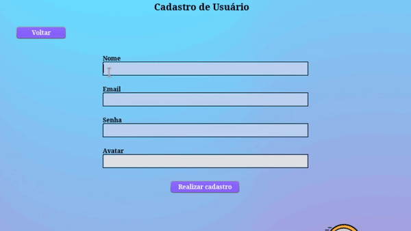
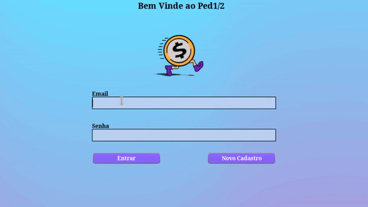
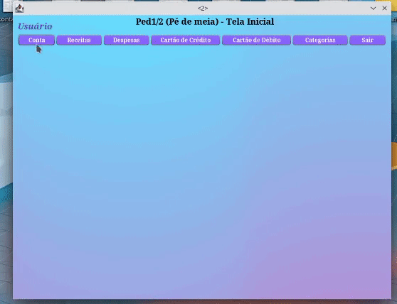
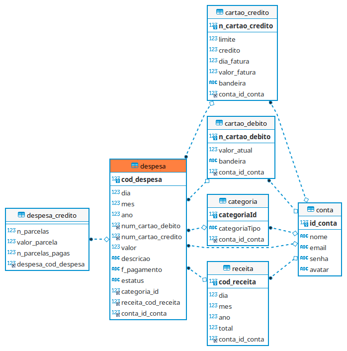
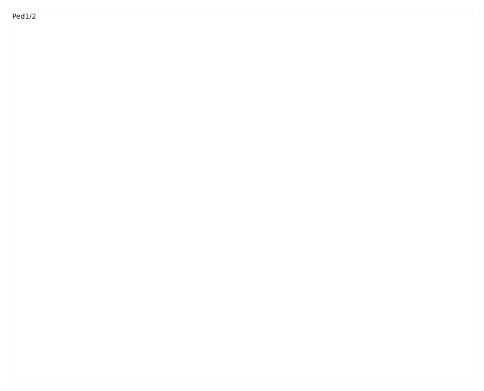
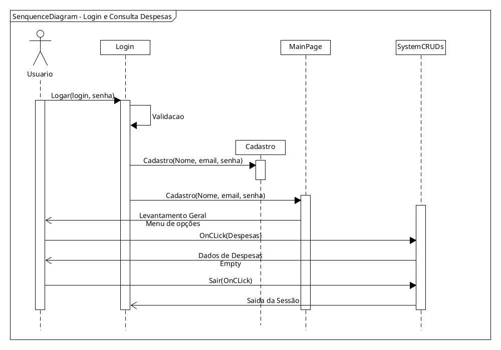

<h1 align="center">PI - Ped1/2</h1>

<h1 align="center">
  
</h1>

Sobre
=========

O controle de gastos é uma atividade importante para o controle financeiro de uma pessoa, família ou empresa, sobretudo para ajudar na educação financeira. Além de proporcionar uma abstração para o usuário em termos financeiros, tem também a tarefa de facilitar o que para muitos é tedioso e complicado, contrinuindo para a facilitação do controle ou gerenciamento de gastos dos atores. Tendo em mãos todas as informações dos gastos, bem como, entradas, saídas, parcelas, etc. Tornar-se-á muito fácil para os atores, encontrar as principais despesas, e assim equilibrar melhor suas finanças.

Com esse pensamento, foi que nossa equipe desenvolveu essa aplicação de gerenciamento e controle de finanças. A equipe formada por: Alan Lopes, Davi Martins, Dirlia Vieira e Marlon Duarte. Desenvolve essa aplicação em Java como uso de SQL para banco de dados. Esse projeto faz parte da Disciplina de Projeto Integrador (I e II) do curso de Ciência da Computação ministrada pelo professor Me. Italo Ribeiro com orientações dos demais professores de áreas diretamente correlatas ao trabalho desenvolvido.

ESTE TRABALHO AINDA ESTÁ EM DESENVOLVIMENTO E PODE CONTER INCONSISTÊNCIA NO FLUXO DE USO ! ! !

Mapa
====
<!--ts-->
   * [Sobre](#Sobre)
   * [Mapa](#Mapa)
   * [Instalacao](#Instalacao)
<!--   * [Dicas](#Dicas)
      * [Pre Requisitos](#pre-requisitos)
      * [Local files](#local-files)
      * [Remote files](#remote-files)
      * [Multiple files](#multiple-files)
      * [Combo](#combo) -->
   * [Prints](#Prints)
   * [Diagramas](#Diagramas) 
   * [Features](#Features)
<!--te-->

Instalacao
==========

Para executar a aplicação será necessário possuir em sua máquina um gerenciador de banco de dados do tipo SQL, usamos o MySQL, mas pode ser outro desde que saida modificar o conector dentro da classe 'moduloConexao.java'. Após isso, qualquer IDE que possa trabalhar com java será capaz de executar o projeto. Recomendamos para isso o NetBeans.

Dicas
=====

Como o software ainda esta em produção e em fase muito prematura, recomendamos que comunique suas observações em -> eletromarlon@gmail.com <-. Para execução, se faz necessário uma boa velocidade de leitura e escrita, o que nos leva a dizer que o SSD no sistema ajuda para evitar ocorrência de engasgos na hora de produção de dados. 

Prints
======
[Inicio](#Sobre)

<h2 align="center">Efetuando cadastro no sistema</h2>  

O sistema de avatars ainda não está terminando, então o usuário precisa desconsiderar essa parte.
  

<h1 align="center">
  
</h1>  

<h2 align="center">Efetuando Login no Sistema</h2>  

<h1 align="center">
  
</h1>  

<h2 align="center">Efetuando Login no Sistema</h2>  

<h1 align="center">
  
</h1>  

Diagramas
=========
[Inicio](#Sobre)

<h2 align="center">Diagramas ER do banco de dados.</h2>  

<h1 align="center">
  
</h1>  

<h2 align="center">Diagrama de Classe do pacote Controllers</h2>  

<h1 align="center">
  
</h1>  

<h2 align="center">Diagrama de Classe do pacote DAO</h2>  

<h1 align="center">
  
</h1>  

<h2 align="center">Diagrama de Classe do pacote Model</h2>  

<h1 align="center">
  
</h1>  

<h2 align="center">Diagrama de Classe do pacote Utilities</h2>  

<h1 align="center">
  
</h1>  

<h2 align="center">Diagrama de Classe do pacote Ordenação</h2>  

<h1 align="center">
  
</h1>  

<h2 align="center">Diagrama de Classe do pacote Views</h2>  

<h1 align="center">
  
</h1>  

<h2 align="center">Diagrama de Caso de Uso</h2>  

<h1 align="center">
  
</h1>  

<h2 align="center">Diagrama de Estado (StateMachine) para situação de login</h2>  

<h1 align="center">
  
</h1>  

<h2 align="center">Diagrama de Sequência para caso de Login e consulta de Despesas</h2>  

<h1 align="center">
  
</h1>  

Features
========
[Inicio](#Sobre)

- [x] Bando de Dados
- [x] Tela de Login
- [x] Tela de Cadastro
- [x] Tela de Cartao de Credito
- [x] Tela de Cartao de Debito
- [x] Tela de Despesas
- [x] Tela de Receitas
- [ ] Tabela de Consulta
- [x] Categorias
- [x] Cadastro de usuário
- [x] Cadastro de cliente
- [ ] Cadastro de produtos
- [ ] ...
